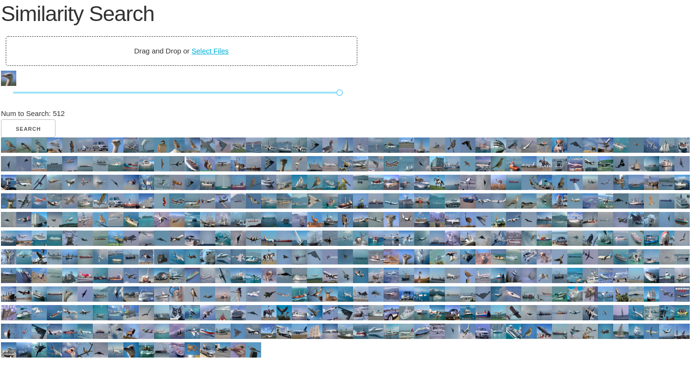
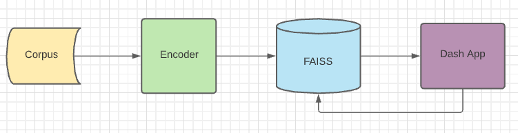
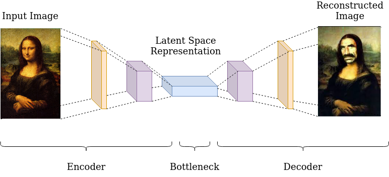
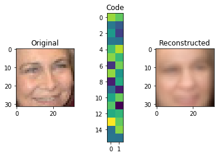

## Help me help you!
### End-to-End Similarity Search for Corpus Exploration



How often do data scientists, engineers, PMs or POs ask questions about large corpora of 
unlabeled and/or unstructured data being collected (usually long before ML or anyone
thought to put effort into labeling or structuring for later analysis)? How often
do you hit a wall like the following when advocating for an effort?

* I wonder what the prevalance rate of X is? If only it didn't too long to explore and may not add value.
* We have a problem we need to sort out and I only have one example.  Give me a few
  weeks to blindly sift through looking for more examples for modeling!
* It would add a lot of value to be able to detect X, but the effort to find the data
  for a model would be too cumbersome.

This small project aims to solve the above situations.  What if there were a way to achieve this 
without large overhead and investment?  What if we could create a full stack application 
without the need for cleaning or labeling or in-depth domain knowledge? Better yet, 
what if we could reuse the same stack without regard for the underlying data type? 
What if the same concept could be used for images, free text, logs or even 
multidimensional signals?

This small project puts on display how to do exactly that! There are some powerful python based tools 
available now for executing similarity searches on billions of records in sub-second times. 
Here I will utilize one [FAISS](https://github.com/facebookresearch/faiss) as the backbone of a stack that includes an 
unsupervised machine learning technique that an entry level data scientist is capable of building, 
training and tuning [PyTorch](https://pytorch.org/).  I will also build a simple web-UI using [Dash by Ploy.ly](https://plotly.com/dash/) to perform 
the searches.  I will then utilize it on two different datasets, CIFAR-10 and a Yelp reviews 
database in order to demonstrate tweaking the same stack to search very different types of data.



All of the code for this project is stored in [this github repository](https://github.com/pdoyle5000/full-stack-similarity-search). 
This project was creating utilizing python 3.8, poetry and ubuntu 20.04. Cloning and running `poetry install` will 
ensure you are using the same dependencies and versions as I am.  If you choose to use something, exclude 
`poetry run` from the commands in my tutorial.

### CIFAR-10 Stack:  The autoencoder.

The idea of this resuable stack depends on the ability to turn data into a vector that responds to a distance metric. 
If you are not famailiar with variational autoencoders you can read about them [here](https://towardsdatascience.com/understanding-variational-autoencoders-vaes-f70510919f73). 
Since CIFAR-10 is an image corpus, an autoendocer that utilizes convolutional layers makes sense.  The amount of 
layers and the size of the encoder output vector are things that should be tweaked in accordance with your data. 
What constitutes as "different" depends on the business need and the type of data itself.  Is "different" 
a car vs a can of beer? "Different" may be a bone-break vs healthy or a noise artifact.  
In a nutshell, the number of layers and the size of the output vector need to be enlarged to pick up on 
smaller differences.  



An autoencoder is two nerual networks that are opposites of each other. The input network is refered to as the encoder 
and the output network the decoder.  The encoder takes an image as an input and outputs a vector.  The decoder 
takes that vector as an input and outputs an image.  The networks are trained together in hopes that the 
decoder does a decent job at creating an image from the vector.  When this happens, that means the important 
information about the image has been captured by the vector and will responde to similarity search.

My convolutional autoencoder is [here](https://github.com/pdoyle5000/full-stack-similarity-search/blob/main/autoencoder/autoencoder.py).

#### Train the Autoencoder

```
# Download the data
wget http://pjreddie.com/media/files/cifar.tgz
tar xzf cifar.tgz

# Train the network! You will need a GPU. A 2080TI was used.
poetry run python autoencoder/train.py
```

While this is training, it will print out losses as it trains. `poetry run mlflow-ui` will spin up 
an mlflow dashboard where you can view progress.  The output will be a model `.pth` file put in the 
`models` folder.  These can be tweaked in the main portion of [train.py](https://github.com/pdoyle5000/full-stack-similarity-search/blob/main/autoencoder/train.py). 
Once the model is trained we can build the FAISS database!




#### Create the Vector Database

FAISS is a GPU backed vector search engine that utilizes a two stage search to make it blazing fast even 
at billion record size.  It is massively overkill for this project, but overkill is fun!

We will utilize only the encoder part of the autoencoder from here on out.  The decoder allows us to train 
but we only require the vector representation of the images for search.

The encoder is initialized and run on an image set then given to FAISS.  FAISS has a few different modes, 
a trainable fast-search and an exhaustive slightly slower one.  I used the IVF clustering trainable mode 
it comes with just for fun as it mirrors other projects I have done using LSH and minhash for sim-search. 
The FAISS database is created, trained, tested, then saved to disk.  The [code is here](https://github.com/pdoyle5000/full-stack-similarity-search/blob/main/cifar_faiss.py). 
The training set is added to the FAISS database and can be searched.  You can only find what is in the database, 
but you can search using anything.

```
poetry run python cifar_faiss.py
```
I hope it is becoming clear here that the FAISS stack can be used on anything as long as it is in vector form. 

#### Create a Dashboard for Exploration

Plotly's Dash framework is a great way for those of us who are bad at javascript to quickly prototype 
and deploy simple, reactive front ends for exploration and annotation in the data science world. It 
also is great for spinning up simple custom dashboards for presenting live metrics to stakeholders.

The code for my app is [here](https://github.com/pdoyle5000/full-stack-similarity-search/blob/main/cifar_app.py). 
The cifar data needs to be copied into an `assets` folder so the FAISS search can find them serverside.

```
mkdir assets
cp -r cifar assets/
```

Spin up the dashboard!
```
poetry run python cifar_app.py
```
Will spin it up on port `8050` locally.  I apologize for the lack of sweet GIFs and MIDI background tunes. 

The application has a simple upload button, you can go to the cifar dataset and select any image to view 
as many similar images as you select on the slider bar.  The images are shown in ranked order from most 
similar to N selected.  There we have it, a similarity search stack that required no information about 
the data had to be searched!

#### Yelp Reviews

I used the same FAISS stack utilizing a sentiment analysis yelp autoencoder I found on github written by 
Tianxiao Shen, Jonas Mueller, Regina Barzilay, and Tommi Jaakkola, and can be [cloned here](https://github.com/shentianxiao/text-autoencoders). 
I was able to very easily clone the repo into my own, run `download_data.sh` and then trained the autoencoder.
```
python train.py --train data/yelp/train.txt --model_type aae --lambda_adv 10 --noise 0.3,0,0,0 --save-dir checkpoints/yelp/daae
```
To utilize the authors data transformation functions I had to rename the repo folder from `text-autoencoders` to `text_autoencoders` 
and fix an indentation flub that my linter is too strict to forgive.  Other than that I was off to the races.

After their autoencoder is trained (on a 2080TI it took a couple hours), the yelp stack can be stood up with:
```
poetry run python yelp_faiss.py
poetry run python yelp_app.py
```

#### Scale it up.

FAISS has the ability to continually accept new data and retrain when triggered.  If this were to be something 
more than a spike and demo, I would containerize the FAISS service behind some http endpoints for add, train and query. 
This way the dash app can be also containerized and deployed without being coupled to FAISS instances so that it can 
replicated as needed.

#### Conclusion

There is a lot of business value for small ML assisted projects like this from a man-power perspective and 
value added to customers in the form of rapid improvements and edge case tweaking as prevalance rates and 
odd things in the data can be easily hunted down.  It is a much easier sell to an organization if one or two 
developers can spin tooling up like this in a single sprint (if you're agile).  This can be utilized 
to bootstrap simple ML models that may add a lot of value (search, huck into labeled folders, train, repeat).

I am aware there are some hard datasets out there where the defintion of "different" can be two artifacts 
that are 99% the same.  In these situations a data scientist could replace the autoencoder with something 
more sophisticated like a triplet network or GAN to train a deeper encoding.  Efforts like this can be a 
great middle ground for convincing your organization to buy into custom machine learning tooling.


